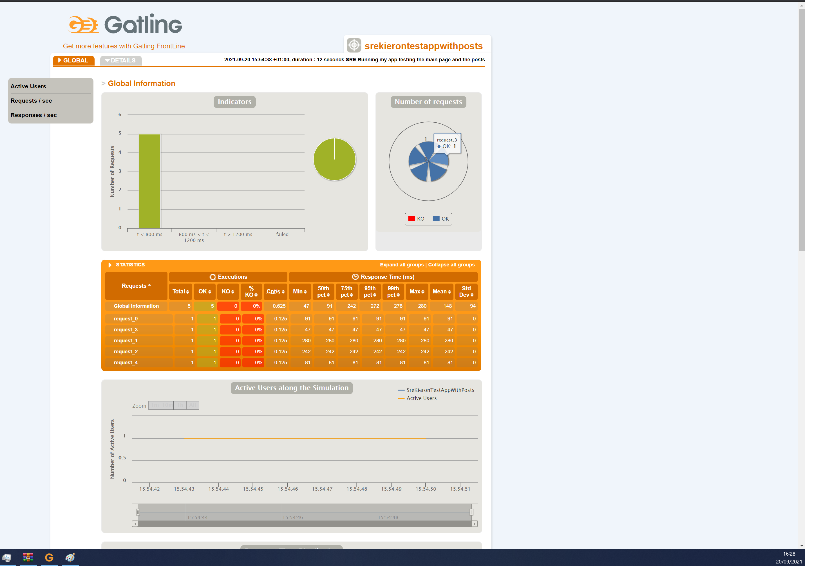
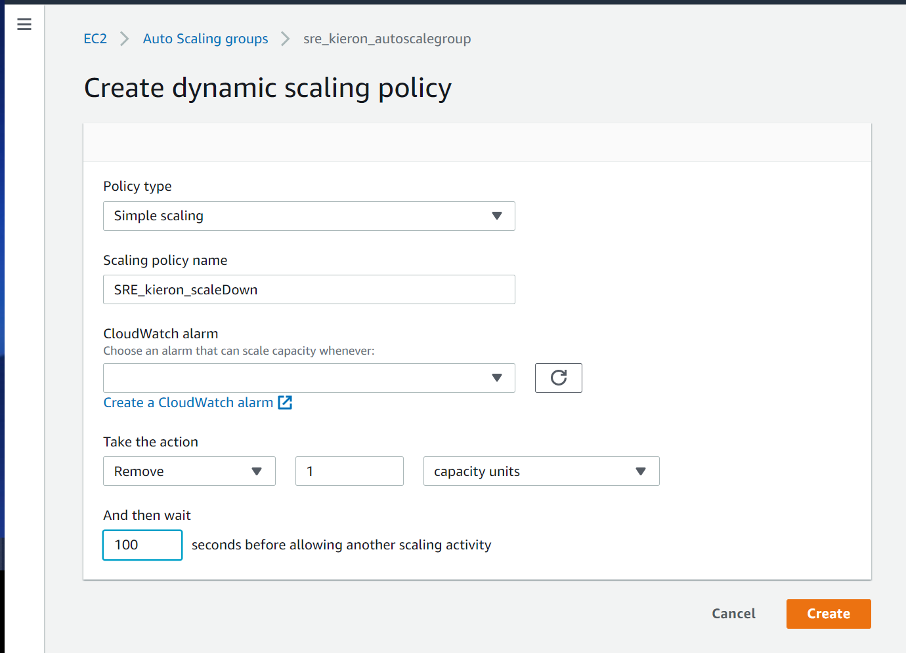

# SRE Gatling

## What is Gatling
Gatling is a load testing tool which can be used for your integrated development environment, version control systems and continuous integration solutions. It does not have its own solution, rather it integrates with your existing solutions.  It is built on top of Akka, which is a toolkit for building distributed message driven applications. It is a distributed framework which will allow for fully asynchronous computing. It is a small entity within code communicating with each other through messaging.

## Gatling File Structure
----
```
+---bin
+---conf
+---lib
+---results
|   +---advancedsimulationstep05-20210920132657118
|   |   +---js
|   |   \---style
|   +---basicsimulation-20210920131556096
|   |   +---js
|   |   \---style
|   +---srekieronspartatest-20210920135455529
|   |   +---js
|   |   \---style
|   \---srekierontestappwithposts-20210920145438015
|       +---js
|       \---style
+---target
|   \---test-classes
|       \---computerdatabase
|           \---advanced
\---user-files
    +---resources
    \---simulations
        \---computerdatabase
            \---advanced
```
----
- `bin` contains the files such as `gatling.bat` and also `recorder.bat` which for windows users is the files used to create and record the gatling tests.
- `results` contains the outcomes of the tests in `.html` format which is used by inserting the full path to the file in your Google Chrome browser.
- `user-files` is the parent directory of `resources` and `simulations`
- `resources` contains
- `simulations` contains the `.scala` files which are created after the `recorder.bat` has been used and a `HAR file` has been input.

## What is Performance Testing
### Load Testing
A load test is a type of performance test that checks how systems function under a heavy number of concurrent virtual users performing transactions over a certain period of time. In other words, the test measures how systems handle heavy load volumes.

### Stress Testing
A stress test is a type of performance test that checks the upper limits of your system by testing it under extreme loads. Stress tests examine how the system behaves under intense loads and how it recovers when going back to normal usage. Are the KPIs like throughput and response time the same as before spike in load? Stress tests also look for memory leaks, slowdowns, security issues, and data corruption.

### Soak Testing
Soak testing (otherwise known as endurance testing, capacity testing, or longevity testing) involves testing the system to detect performance-related issues such as stability and response time by requesting the designed load on a system.
The system is then evaluated to see whether it could perform well under a significant load for an extended period, thereby measuring its reaction and analyzing its behavior under sustained use. Soak testing is a type of load testing.

### Spike Testing
Spike testing is a type of performance testing in which an application receives a sudden and extreme increase or decrease in load. The goal of spike testing is to determine the behavior of a software application when it receives extreme variations in traffic. Spike testing addresses more than just an application's maximum load; it also verifies an application's recovery time between activity spikes. The word “spike” refers to the sudden increase or decrease in traffic.

## Scaling and Scaling Out

## User Experience/Journey
- Scalable
- Highly Available

## What Should be Monitored for an Internet Facing Application
### Resource Monitoring
Also known as server monitoring or infrastructure monitoring, this operates by gathering data on how your servers are running. Resource monitoring tools report on RAM usage, CPU load, and remaining disk space. In architecture with physical servers, information on hardware health—like CPU temperatures and component uptime—can also be helpful to avoid server failure. In cloud-based environments, aggregates of your virtual server system are more useful. 

### Application Performance Monitoring (APM)
APM is the process of monitoring the application environment from an IT perspective using various techniques, including live code profiling, exception tracking, and distributed tracing. In addition to APM, some tools—like AppOptics—also monitor the underlying infrastructure of the application environment, such as application hosts, database servers, and cloud services. APM typically requires application instrumentation to monitor, and it can sometimes affect the application performance or its underlying infrastructure

### Network monitoring 
This looks at the data coming in and out of your computer network. Your monitoring tool captures all incoming requests and outgoing responses across all components such as switches, firewalls, servers, and more. The data collected from network monitoring can be as simple as the total amount of data coming and going or as nuanced as the frequency of particular requests

## Steps to Complete Gatling Testing
### Recording the HAR file
1. Navigate to the HTTP which you would like perform testing on
2. Once at the designated page `right click` > `inspect` this should load up console either on the bottom or right side of the screen
3. Click the `Network` heading on the top bar

4. Tick the `Preserve log` and then move to the left where a circular stop sign which represents `clear` press this symbol
5. Perform the interactions which you would like to record and test
6. Once finished press `Export HAR` which is located just under the application header and is a down facing arrow
7. Save the file in a memorable location as this will need to be accessed for the next step

### Running the Tests
1. Head over to your `gatling-charts-highcharts-bundle` directory which I have defined the structure above
2. `cd bin` which will then show the `recorder.bat` file which now needs to be ran using `./recorder.bat`
3. This will bring up a screen we want to head over to the top-left corner to the `recorder` dropbox and select HAR

4. This will display the correct screen for us which is displayed below

5. We then select browse and locate the output file of our previous steps of recording the HAR file
6. On the right side of the screen, Name your file as this will be needed for a later step
7. Once thats loaded in, do NOT click anything other than `Start`
8. Navigate to your directory and you should see the created file with the name attached.
9. Run the command `./gatling.bat` and this should bring up a display.
```
Choose a simulation number:
     [0] RecordedSimulation
     [1] SreKieronSpartaTest
     [2] SreKieronSpartaTest2
     [3] SreKieronTestAppWithPosts
     [4] computerdatabase.BasicSimulation
     [5] computerdatabase.advanced.AdvancedSimulationStep01
     [6] computerdatabase.advanced.AdvancedSimulationStep02
     [7] computerdatabase.advanced.AdvancedSimulationStep03
     [8] computerdatabase.advanced.AdvancedSimulationStep04
     [9] computerdatabase.advanced.AdvancedSimulationStep05

```
10. Select the number and press enter
11. Write a description for the task 
12. Once complete an output `.html` file should be printed to the console, Paste this in your internet browser to view the results!

### Results


## Editing The Tests
When creating the test from HAR files this creates a `.scala` file which is used to edit and modify the tests
```
class SreKieronTestAppWithPosts extends Simulation {

        val httpProtocol = http
                .baseUrl("http://34.243.55.216")
                .inferHtmlResources()

```
Here we see the `.baseUrl` which is used to tell the script what the target IP which is being tested.

### Changes to the Test
```
        setUp(scn.inject(atOnceUsers(1))).protocols(httpProtocol)
}
```
This line of code is at the end of the `.scala` file which is how you are able to change the injection of users by editing the number in the brackets from 1 to whatever value you are wanting.

## Auto Scaling policies
```
resource "aws_autoscaling_policy" "sre_kieron_scaledown" {
  name = "sre_kieron_scaledown"
  scaling_adjustment = -1
  adjustment_type = "ChangeInCapacity"
  cooldown = 300
  autoscaling_group_name = aws_autoscaling_group.sre_kieron_autoscalegroup.name

}
```



## Metrics and Dashboard


## Creating an Alarm
1. Navigate to `CloudWatch`
2. Click `Create Alarm`
3. Press `Select Metric` followed by what you would like the alarm to trigger by in my example I used `CPUUtilization`
4. To get to my metric click `EC2` > `By Auto Scaling Group` then find your `AutoScalingGroupName` then finally tick the box for `CPUUtilization`
5. Click `Select Metric`
6. This will bring you to a page where you specify the Metric and Conditions
7. Here I changed the `Period` to 1 minute
8. Condition I used `Static` , `Less than < threshold` and for the define the value `20`
9. Click `Next`
### At this stage you can either create your `SNS Topic` or `Create new topic` in this example I will chose the latter
10. Select `Create new topic` and enter the topic name which should follow a naming convention for us `SRE_name_whatitis`
11. Email endpoint is the address which will recieve the notification
### Here we have the option to add Auto Scaling action
12. Select `In alarm` and Resource type as `EC2 Auto Scaling group` and select your group from the dropdown menu
13. Take the following action should be available and here we select what will happen once the alarm is triggered for me its scale down (remove 1 instance)
14. Click `Next`
15. Add your alarm name and a description 
16. Then finally click `Create`

### Alternate way would be to user Terraform
```
resource "aws_cloudwatch_metric_alarm" "sre_kieron_sd_alarm" {
  alarm_name = "sre_kieron_sd_alarm"
  comparison_operator = "LessThanThreshold"
  metric_name = "CPUUtilizaton"
  statistic = "Average"
  threshold = "20"
  period = "60"
  evaluation_periods = "2"
  namespace = "AWS/EC2"
  alarm_description = "Monitors ASG EC2 average CPU usage "
  alarm_actions = [aws_autoscaling_policy.sre_kieron_scaledown.arn]
}

```

## Simple Notification Service (SNS)
1. Navigate to the SNS dashboard and select `Topics`
2. If you followed the previous steps your topic should be available
3. Once a topic is created there is a `subsription` which is paired, This needs to be confirmed by an email which is sent to the endpoint set in setup
4. Once confirmed your set-up is complete

### SNS Application 2 Person (A2P)
You can deliver the notification from SNS to a variety of streams such as:
- SMS Deliver events to mobile phones as text messages.
- Email Deliver events to inboxes as email messages.
- Platform endpoint Deliver events to mobile phones as native push notifications

### SNS Application 2 Application (A2A)
You can subscribe to Amazon Simple Notification Service (Amazon SNS) topics for one or more Amazon SQS queues. When you publish a message to a topic, Amazon SNS sends the message to each subscribed queue. Amazon SQS manages the subscription and any necessary permissions.
This is where the SNS delivers a notification to an application apposed to a person an example of this would be to send it to Amazon SQS which is used for Delivering events to queues for application integration purposes.

### The Results
Here is an example email which I have recieved from AWS alerting me of my EC2 instance in the AutoScaling group has triggered an alarm, this in turn sent out an email to my endpoint email address.

